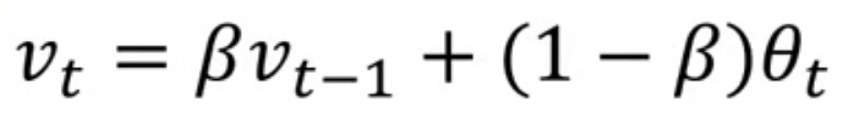
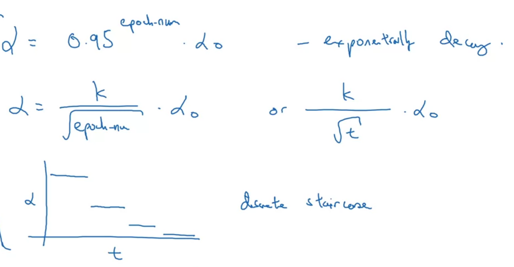

# Introduction
* Algorithms that reduce the loss.
* Iterative approaches
* Many algorithms such as Gradient descent and mini-batch gradient descent.

# Exponentially Weighted Averages
* Basically you average for previous n number of days
* Kind of like moving average.
* The more the number you take, the less flexible and less likely to adapt to the changes.
* The less number you take, the more wiggly the curve will be.
* Equation for exponentially weighted average is shown below.
    * 
    * We are essentially averaging for 1/1-$\beta$
* Effectively, if we break down the numbers, then the value of each coefficient diminishes exponentially.
* Further, it is observed that the sum of values of coefficient is close to 1.
* Uses something called bias-correction.
* Thus, bigger the value of $\beta$, the slower the convergence.

# Bias Correction
* Problem with exponentially weighted average is that if the value of $\beta$ is chosen to be high, then initially, the predictions are wrong because of slower convergence.
* To solve this, use the below shown equation.
    * 
* Does, bias correction helps in accurate predictions in early/initial phase.

# Momentum in GD
* Problem with GD is with learning rate.
* If learning rate too small, convergence is very slow and if too large, convergence might not happen because of exploding gradient problem.
* To address this problem we can think of it as following.
    * On vertical axis, you want slower learning and on horizontal axis you want fater learning because you want to move progressively from left to right.
* This is where momentum comes into picture.
* Algorithm shown below
    * 
* Basically, it smoothens the mini-batch gradient descent.

# RMSProp
* In GD, there are huge oscillations in vertical direction and less in horizontal which is the problem to address.
* RMSProp assumes that the vertical axis represents bias and horizontal axis represents weights.
* Thus, effectively, it sppeds up weight change and slows down bias change according to the algorithm shown below.
    * 
* This works because the derivatives in vertical direction are large and vice versa.
* Here, now you can even use a bit larger value of learning rate.

# Adam
* Basically momentum in RMSProp.
* Full form is adaptive moment estimation.
* Typically implement bias correction too.
* Algorithm shown below
    * 

# Learning Rate Decay
* Used for faster convergence.
* Main intuition behind this is that gradient descent would take larger steps initially and as the number of epochs increases, the value will decrease resulting into a convergence.
* There are many versions of this as shwon below.
    * Commonly used
        * 
        * decay rate and initial learning rate becomes the hyperparameters.
    * Others Decay
        * 