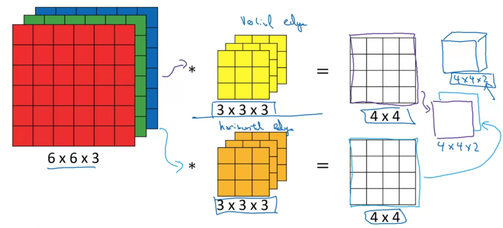

# Introduction
* Really useful field of deep learning.
* On its own is not interesting but what makes it interesting is its ability to handle very large input features (even of the order of 48MP * 3 (for rgb)).
* The key operation behind this is convolution operation which works as a key to identifying different areas.

# Vertical edge detection
* Suppose you are given an image (grey scaled) and you wish to detect vertical images, then you use convolution operation.
* Basically, it means that you take a smaller matrix suppose (3x3) and then convolve it with the image matrix.
* The "convolve" just means that you overlap it with the image matrix and then multiply element wise and get a number.
* Further, you repeat the above step until all the cells are covered at least once.
* For vertical edge detection, you generally use 3x3 matrix with values 1 in first column (bright pixels), 0 in second (greyish pixels) and -1 in third (dark pixels).
* However, one problem with the above approach is that it only detects edges, it does not detect the transition of edges i.e whether it is from light to dark or from dark to light etc.
* For that, we can flip the convolution matrix or flip the image matrix.
* Futher, there is no need to remember these filer. You can take these as parameters and let your neural netowrk learn these for all sorts of edge detectors through back propagation.
* Lastly, note that for a n x n matrix and f x f convolution matrix, the resulting matrix would be n - f + 1 x n - f + 1 dimensions.

# Padding
* There are two problems with the above approach.
* First is that the image dimensions reduces and eventually can become really small.
* Second is that the pixels at the corner are not considered as much time as the pixels in the middle portion of the matrix.
* To solve these problems, padding is used.
* What it means is that you add zeros on each side of the matrix essentially increasing the dimensions of the matrix.
* How much to "pad" is upto you.
* suppose you pad p.
* Then the resulting dimensions would be n+2p-f+1 x n+2p-f+1.

# Valid and Same Convolution
* Valid means no padding
* Same means you pad such that the output size of the image (after convolution) is same as the input size of the image.
* For that, the equation is p = (f-1)/2.
* Thus, it is generally observed that f is always odd.

# Strided Convolution
* Stride just means how many jumps you want to take.
* Taking some n number of jumps instead of 1.
* Surf internet for more details if not clear.
* suppose stride number is s.
* output dimension would be floor(((n+2p-f)/s)+1 x floor(((n+2p-f)/s)+1

# Convolution for RGB images
* Now here, we dont convolve with fxf filter but actually fxfx3 filter.
* Note that the output of this would not contain the number of channels thing.
* Output would be a regular 2d matrix.
* Here, we add all the f\*f\*3 numbers and get a 2d matrix.

# Multiple filters
* Suppose instead of only detecting the vertical or horizontal edges, what if you want to detect all types of edges at once.
* So basically, you perform individual filter operations and stack them by volume for each filter to get the required/desired output.
* Note that the number of filters is the last part of the dimensions.
    * 

# Extras
* Read on difference between cross-correlation and convolution.