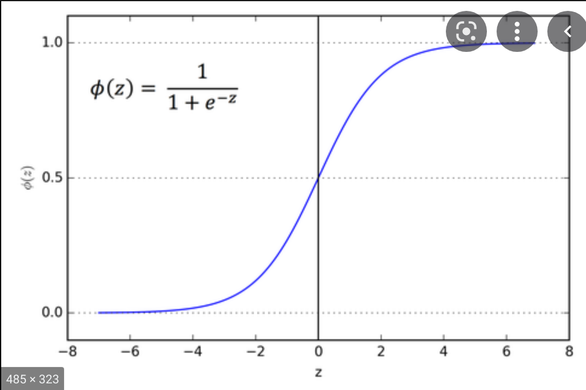
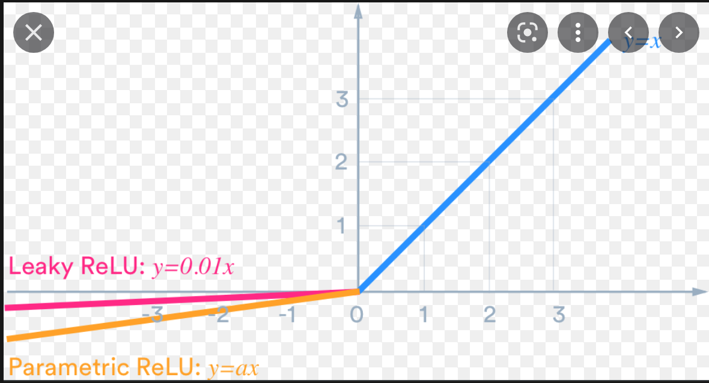

# Uses
* Provides non-linearity to the output of each hidden neuron
* Why do we need non-linearity?
    * Each hidden neuron calculates linear function (Wx + b)
    * If there was no linearity, the output of even multiple neurons will be a linear function itself.
    * Then, it wont be better than traditional machine learning models
    * Thus, we need non-linearity

# Types
* There are 5 types of activation functions
* Sigmoid
    * 
* Softmax
    * 
    * 
* tanh
    * 
* ReLU
    * 
* Leaky ReLU
    * 

# Overall
* 

# Which to choose?
* If your end goal is a classification problem then choosing sigmoid for output layers is a must.
* For hidden layers, you can choose any of the activation functions.
    * However, nowadays, ReLU and Leaky ReLU are a popular choices.