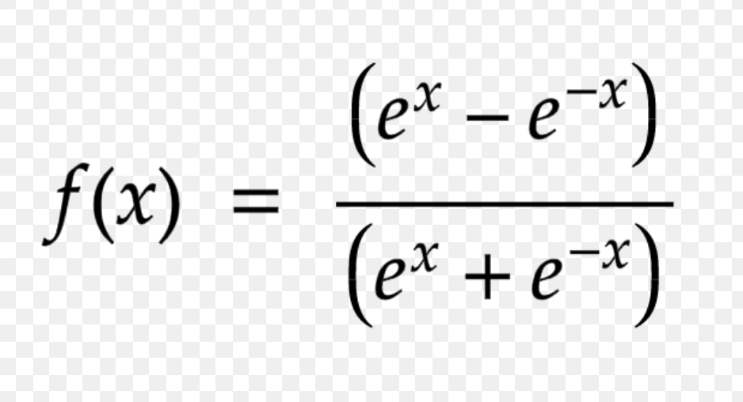

# What is deep learning?
* Understand that deep learning is same as Neural network.
* Both are used like synonyms
* Basic definition includes a machine or algorith that imitates human neurons.
* These help in making the machine think like human beings.
* Types of data that machine can **now** understand includes structured and somewhat unstructured data because of which self-driving cars came into picture.

# Resources
* Deep Learning specialization on coursera offered by Deeplearning ai (Company run by Andrew NG).

# Basics
* These are basic connections between each neuron.
* These are also called as neural networks.
* The basic structure of deep learning network are layers.
    * There can be as small as 2 layers and can extend to 1000s of layers.
    * First layer is always called as input layer and last layer is always called as output layer.
    * There can be 'n' number of intermediate layers.
    * These are sometimes also called as hidden layers.
    * Computations flow from input layer to output layer.
* Basic computations are done for each observation at each neuron and then the output of these are passed on to the next set of layers which can be either hidden layer or output layers.

# What happens at each layer?
* At each layer, a linear regression is computed, i.e y = wt.x + b.
* Problem with this is that linear regressions are not confined to a range. It is fairly possible that they may output certain values that we know the problem at hand wont take.
    * For example, consider House price predictions.
    * It is possible that the linear regression model can take negative values but price of house can never be negative.
* Thus, to overcome this, each neuron in each layer applies an activation function.
* The job of activation functions are twofold.
    * First is to make the output of each neuron scaled down to a range.
    * Second is it smoothens out the irregularities (if any) from any neuron.
* Then the output from the activation function is supplied as the input to the next layer and the process is repeated.

# Types of activation functions
* ReLU --> Rectified Linear Units
    * max(z, 0) where z is the output from the linear regression.
* Softmax --> 
    * Speciality is that the range will always be [0, 1]
    * Can be used as probability estimates which can be useful for classication problems.
* tanh --> 
* Each function has their own advantage and disadvantage which will be further discussed in detail later.