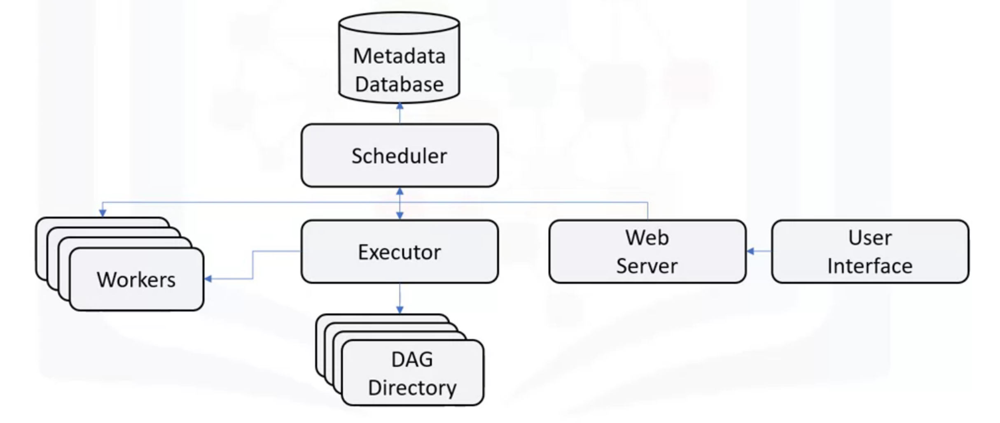

# Introduction
* Apache Airflow is a platform to programmatically author, schedule and monitor workflows.
* Main features of it are use of pure python, useful UI, integration, easy to use and open source community.
* It works on the principle of scalable, dynamic, extensible and lean.
* Note that a workflow is represented as a DAG.
* **It is used for batch processing and not a data streaming solution.**

# Architecture
* 
* Scheduler handles the triggering of all scheduled workflow.
* Executor handles running of the tasks provided by scheduler.
* Workers actually perform the task
* Web server serves UI which can be used to inspect, run or debug any of the task.
* DAG directory contains DAG files to be accessed by others.
* Metadata database stores state of each task and data.

# Lifecycle
* 

# DAG Intuition
* Each edge has a direction and acyclic means that there are no loops.
* Used by apache airflow.
* Each tasks performed by the workers are nodes in graph.
* Edges represent the dependencies between two tasks in the pipeline.
* It defines the order in which the two tasks should run.
* Code to be written in python.
* One more use of scheduler is to deploy the created DAG files. (DAG files are simply python code that create a DAG for a number of  tasks)
* Airflow, thus, performs the following tasks
    * Deploys on worker array.
    * Follows the DAG
    * Schedules the first DAG run
    * Subsequent runs are also integrated.
* Advantages
    * Maintainable
    * Versionable
    * Collaborative
    * Testable
* Code components
    * Library imports
    * DAG arguments
    * DAG Definition
    * Task Definitions
    * Task pipelines or dependencies.

# Operator
* Determine what each task does.
* Hence, we can say that tasks implement operators.
* Eg. Python operators, SQL quesries, sensor, emails, http requests etc.

# Logs and Monitor
* Default stored in local storage (when in development stage)
* Also supports storage of logs on cloud (esp. when in production stage)
* format - logs/dag_id/task_id/execution_date/try_number.log
* Not only provides UI but also CLI.
* 3 types of metrics for monitoring
    * Counter: Metrics that always increase (like count of failures or success)
    * Gauges: Metrics that may fluctuate (number of running tasks, BAG bag size or number of dags in production)
    * Timers: Metric related to time duration (like time to finish a task)

# Storage
* Airflow metrics --> StatsD (network daemon that receives and forwards metrics) --> Prometheus (metrics monitoring and analyzing tool/system) --> Dashboad