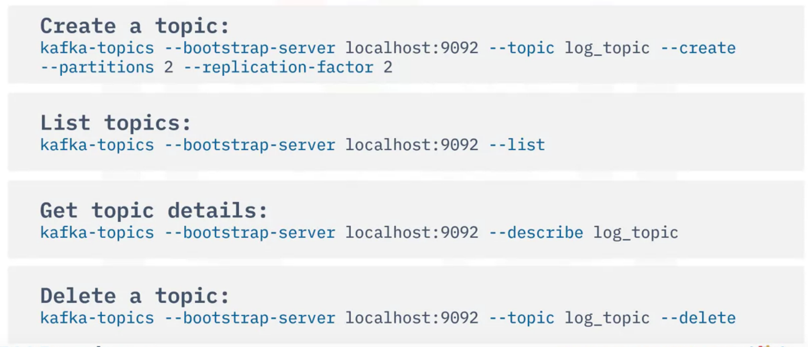

# Introduction
* Events describe an entity's observable state updates over time.
* Event formats
    * Primitive
    * Key-Value pair
    * Complex Data types (JSON, XML etc.)
    * Key-value with timestamp
* Situations
    * One source to one destination
        * Event streaming from one event source (like a group of sensors, devices, applications etc generating large volumes of data) to one destination (like file systems, databases, applications etc).
    * Many to Many relationship
        * Complex and most common situation in real world scenario
        * This is because there can be many data sources that work on different protocols for data transfer.
        * Furthermore, it is also possible that an event source is destination for other pipelines.
* Thus, there is a need for ESP (Event streaming platform) to take care of such situations.
* ESP is a middle layer amongst various sources and destinations and provides a unifying interface for ETL.
* Thus, all the sources now only sends data to ESP.
* The destination first subscribes to the ESP and later consumes the data it provides.
* Components of ESP
    * Event Broker
        * Designed to receive and consume events.
        * Core Component
        * Subcomponets
            * Ingester - Efficiently receives events from various sources
            * Processor - Performs operations on data like serializing, compressing etc.
            * Consumption - Retrieves events from event storage and effectively distributes to various event destinations.
    * Event storage
        * Events from event sources are stored here.
        * Event destination doesn't need to sync with sources because now they can access data from here anytime.
    * Analytic and Query Engine
        * Used for quering and analyzing stored events.
* Popular ESPs
    * Amazon Kinesis
    * **Apache Kafka**
    * Apache Spark
    * Apache Storm
    * Apache Flink

# Use case
* User activities (Mouse clicks, screen time etc.)
* Metrics (GPS location etc.)
* Logs
* Financial transactions and more
* Store in databases
* Real time analytics
* Triggered push notifications
* Governance and audit

# Architecture
* It follows a distributed client server architecture.
* Distributed servers contain cluster of brokers used for event collection, storage and distributions.
    * These clusters are maintained by Apache zookeeper which is another distributed system.
* It follows TCP network protocol.
* It has distributed clients including Kafka CLI, High level APIs, Rest APIs and third party UIs.
* 

# Features
* Distribution System
* Highly scalable
* High throughput
* Parallelism and fast
* Hihgly reliable and fault tolerant because event storage has multiple partitions and replications.
* Permanent Persistency
* Open source

# Kafka Producer
* Kafka Producer publishes events in the order in which they are meant to be published.
* Kafka Producers are client applications
* An event can be optionally associated with a key.
* Same key --> Published to same topic partition.
* Events not associated with any key will be published to topic partitions in rotation.
* Also has CLI.

# Kafka Consumer
* Once producer jobs are created, one can create consumers which are clients subscribed to topics.
* Middle layer between event storage and event destinations.
* Thus, event destinations read events from consumers.
* Read data in same order as they are published.
* Store an offset record for each partition as the last read postion.
* No sync is required between producer and consumer.
* Also has CLI

# Extras
* Even though apache kafka is amazing, its complexity in deployed needs assistance from a professional.
* Hence, many services have been created on top of kafka to aid the customers.
* These include Confluent cloud, IBM Event streams, Amazon MSK.
* Topic in kafka refers to any database that stores a certain type of event data.
* Kafka CLI (brief)
    * 