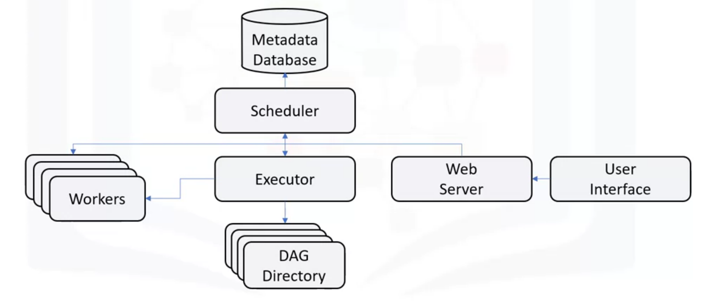
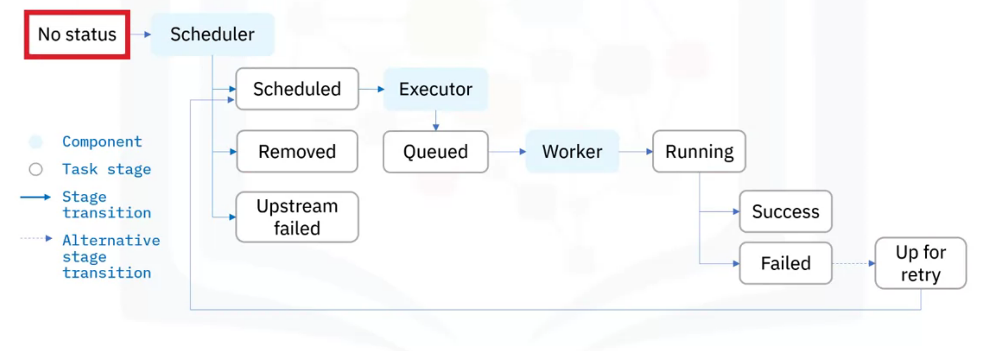

# Introduction
* Apache Airflow is a platform to programmatically author, schedule and monitor workflows.
* Main features of it are use of pure python, useful UI, integration, easy to use and open source community.
* It works on the principle of scalable, dynamic, extensible and lean.
* Note that a workflow is represented as a DAG.
* **It is used for batch processing and not a data streaming solution.**

# Architecture
* 
* Scheduler handles the triggering of all scheduled workflow.
* Executor handles running of the tasks provided by scheduler.
* Workers actually perform the task
* Web server serves UI which can be used to inspect, run or debug any of the task.
* DAG directory contains DAG files to be accessed by others.
* Metadata database stores state of each task and data.

# Lifecycle
* 

# DAG Intuition
* Each edge has a direction and acyclic means that there are no loops.
* Used by apache airflow.
* Each tasks performed by the workers are nodes in graph.
* Edges represent the dependencies between two tasks in the pipeline.
* It defines the order in which the two tasks should run.
* Code to be written in python.
* One more use of scheduler is to deploy the created DAG files. (DAG files are simply python code that create a DAG for a number of  tasks)
* Airflow, thus, performs the following tasks
    * Deploys on worker array.
    * Follows the DAG
    * Schedules the first DAG run
    * Subsequent runs are also integrated.
* Advantages
    * Maintainable
    * Versionable
    * Collaborative
    * Testable

# Operator
* Determine what each task does.
* Hence, we can say that tasks implement operators.
* Eg. Python operators, SQL quesries, sensor, emails, http requests etc.