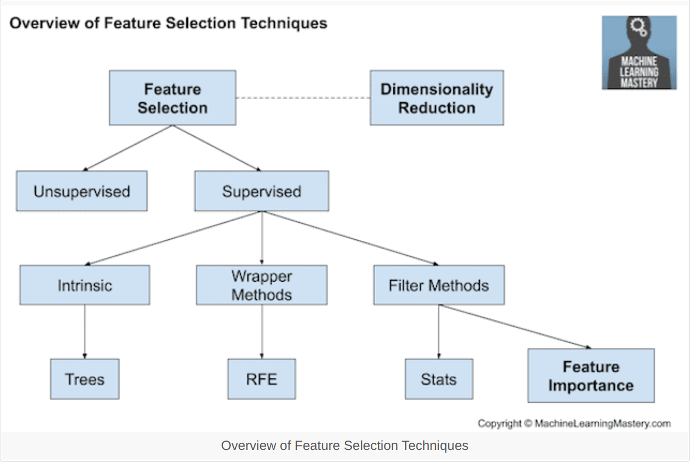
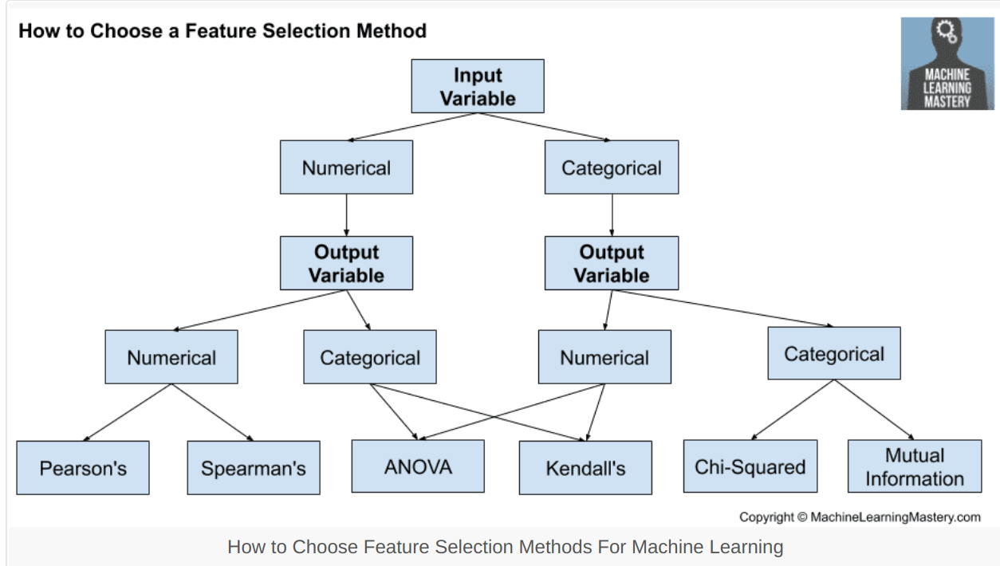

# Curse Of Dimensionality
* When dimensionality increases, the volume of the space increases so fast thtat the available data becomes sparse.
* In order to obtain a reliable result, the amount of data needed often grows exponentially with the dimensionality.
* This means that our model is squeezed into remaining space.
* This leads to development of some techniques of dimensionality reduction like PCA (Principal Component Analysis) and PLS (Partial Least Squares).

# Ideal Set of features
* **High vairance** - Feature with a lot of variance contain a lot of potential signal.
* **Uncorrelated** - Features that are highly correlated with each other are less useful because both have redundant signals.
* **Not that many** - Low number of features relative to the target variable oberservation.

# Techniques
* PCA (Principal Component Analysis)
    * Gives us the ideal set of features.
    * Ranks features based on variance.
    * So we can throw away the lower ranked components as they contain littler signal.
    * First PC (Principal Component) is simple linear regression.
        * This means that each PC is a linear combination of the individual features.
    * However, for obvious reasons, there will occur some loss of information.
* PLS (Partial Least Squares)
* Univariate Selection
    * SelectKBest from sklearn
    * Uses a **univariate** statistical test for features to select **k** best features.
    * Takes in the scoring function and k-value and returns score and p-values. 
    * One such function is chi-squared. Note that it is only valied for **non-negative** features.
    * Scoring function list
        * For regression --> f_regression, mutual_info_regression.
        * For classification --> chi2, f_classif, mutual_info_classif
        * The methods based on F-test estimate the degreee of linear dependency between two random variables.
        * On the other hand, mutual information methods can capture any kind of statistical dependency, but being nonparametric, they require more samples for accurate estimation.
* Feature Importance
    * Gives you score for each feature of your data, the higher the score more important or relevant is the feature towards your output variable.
    * Higher the scores, the more related it is with the target variable.
    * scikit learn's ExtraTreesClassifier has built in feature importance scores.
* Correlation Matrix
    * See the correlation between each features and output variable.
    * Hence, higher the corealtion between feature and output variable, the feature should be selected.
* RFE
    * Recursive Feature Elimination
    * Gives an external estimator that assigns weights to features.
    * Selects features by recursively considering smaller and smaller sets of features.
* 

# How to select feature selection method?
* 

# Links
* [Good but long article](https://machinelearningmastery.com/feature-selection-with-real-and-categorical-data/#:~:text=Feature+selection+is+the+process,when+developing+a+predictive+model.&text=There+are+two+main+types,into+wrapper%2C+filter+and+intrinsic.)
* [Feature Selection Techniques with Python](https://towardsdatascience.com/feature-selection-techniques-in-machine-learning-with-python-f24e7da3f36e)
* [Undetstainding PCA](https://towardsdatascience.com/understanding-pca-fae3e243731d)