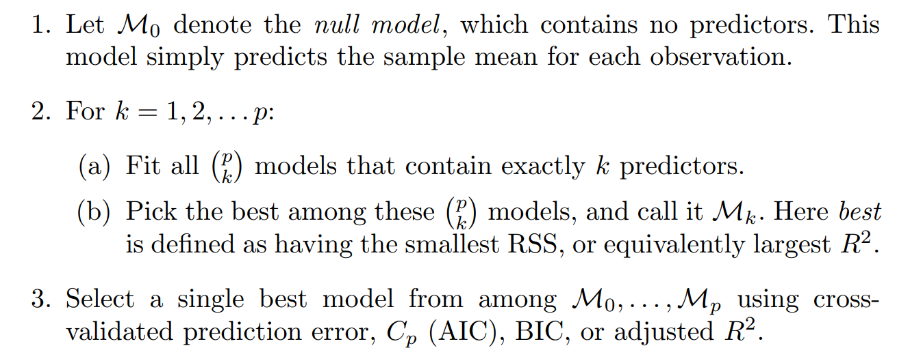

# Linear Model Selection And Regularization
* Alternatives to least squares method
    * Subset Selection --> Identifying a subset of the p predictors that we believe to be related to the response.
    * Shrinkage --> Fitting a model involving all p predictors but the estimated coefficients are shrunken towards zero relative to the least squares method.
    * Dimentionality Reduction --> Projectivg the p predictors into an M-dimensional subspace where M < p.
* Subset Selection
    * Best Subset selection
        * Fit a separate least squares regression for each possible combination of the p predictors.
        * Then select the model that gives the best performance.
        * This means we fit 2^p linear models.
        * Algorithm
            * 
        * According to this algorithm, the RSS decreases monotonically when number of features are increased and hence we need to select the features carefully otherwise we may end up involving all the features.
        * Hence, in step3 we use cross validation so that it gives RSS or R2 on **test** set.
        * In case of logistic regression, we use deviance instead of RSS.
        * The deviance is negative two times the maximized log-likelihood. This means that smaller the deviance, the better the fit.
    * Forward Stepwise Selection
        * Begin with a model containing no predictors.
        * Then, add predictors to the model, one at a time until all predictors are in the model.
        * In each step, the feature that gives the greatest additional improvement to the fit is added to the model.
        * This greatly reduces the number of models to be fitted instead of 2^p.
        * Algorithm
            * 
        * Computational advantage over best subset selection.
        * Does not take into account the interaction between the two features.
        * Can be applied when n < p.
    * Backward Stepwise Selection
        * Begins with the full least squares model containing all p predictors and then iteratively removes the least useful predictor.
        * Algorithm
            * 
        * Requires n >> p.
    * **Choosing the optimal model**
        * We are trying to minimize the training set RSS and R2. However, we want to minimize the test set RSS and R2.
        * Thus, we need to estimate test set scores.
        * Some of these are Cp, Akaike Information Criterion (AIC), Bayesian Information Criterion (BIC) and adjusted R2.
        * Cp statistic adds a penalty to the training RSS in order to adjust for the fact that training error underestimates test error.
        * Penalty increases as number of predictors increases.
        * Choose the model with lowest Cp value.
        * AIC is defined for a large class of models fit by maximum likelihood.
        * Cp and AIC are proportional to each others.
        * BIC is similar to Cp but with Bayesian POV.
        * It used logarithm and hence it places much more heavier penalty on models with many variables and hence results in the selection of smaller models than Cp.
        * Adjusted R2 is another popular approach for selecting among a set of models.
        * Adjusted R2 is high means good model.
        * It means that once all of the correct vairbales have been included in the model, adding noise variables will lead to only a very small increase.
        * Cross validation methods are really better than these methods because it directly estimates the test error rate.
        * However, if we repeat the validation set approach using a different set, then test error rate might change.
        * Thus, select a model using **one standard error rule**.
            * We first calculate the standard error of the estimated test mse for each model size and then select the smallest model for which the estimated test error is within one standard error of the lowest point on the curve.
* Shrinkage Methods
    * Ridge Regression
        * Here, the coefficients are estimated by minimizing RSS + lambda*(sum(coefs^2)).
        * Lambda is called the tuning parameter and is always >= 0.
        * Thus, it adds a shrinkage penalty which is small when coefs are close to zero and so it essentially has an effect of shrinking the estimates of coefs towards zero.
        * When lambda is 0, no effect of penalty terms and coefs be same as that of Linear Regression.
        * When, lambda is infinity, coefs will shrink to 0.
        * One thing to note here is that the standard least squares coefficient estimates are scale equivariant.
        * This means that multipyling Xj by a constant c simply leads to a scaling of the least squared coeff estimates by a factor of 1/c.
        * However, in ridge regression coeff estimates can change substantially when multiplying a given predictor by a constant.
        * Therefore, it would be better to standardize the parameters before applying ridge regression.
        * Ridge Regression is an improvement over Least squared because of bias variance trade off.
        * **Follows l2 norm.**
    * Lasso Regression
        * Ridge Regression may make the coeffs very small but unless lamda is infinity, it will not make it completely zero.
        * This means that ridge regression will consider every feature which might not be desired.
        * Lasso Regression overcomes this problem and the difference here is that it follows **l1 norm.**
        * RSS + lambda(sum(coefs))
        * lambda >= 0 is a tuning parameter.
        * Similar to best subset selection, the lasso performs variable selection.