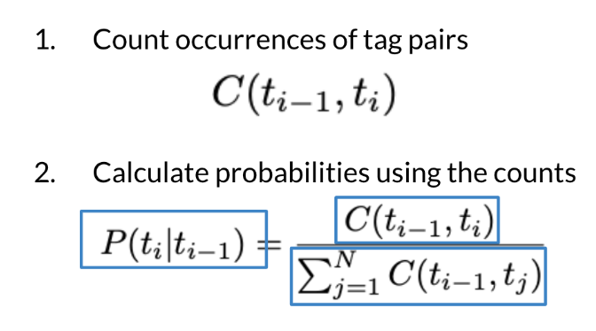
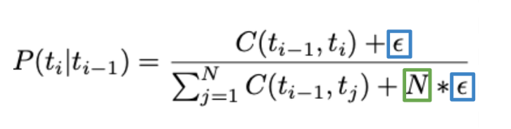
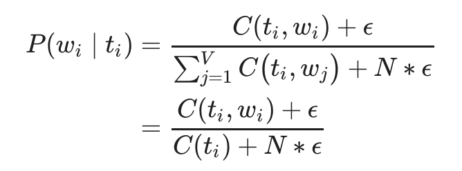
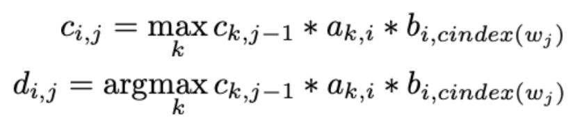
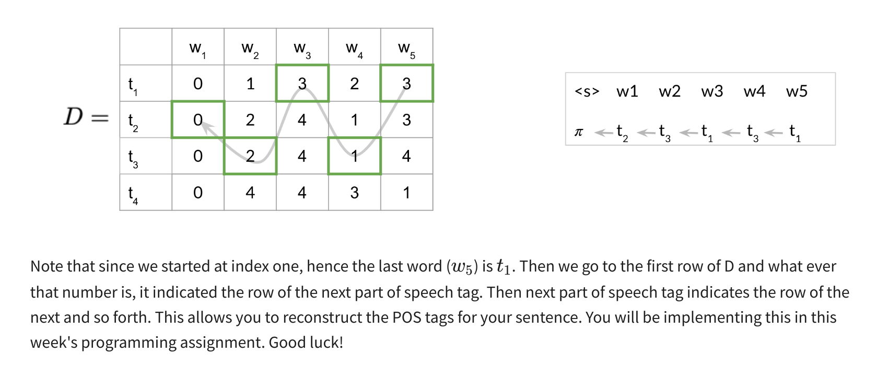

# Introduction
* POS is a process of assigning a part of speech (noun, adverb, verb etc) to a word.
* Used for identifying named entities, speech recognition, coreference resolution
* Basically, use the probabilities of POS tags happening near one another to come up with the most reasonable output.
* Following are the concepts used for POS
    * Markov Chains
    * Hidden Markov Models
    * Viterbi Algorithm

# Markov Chains
* Markov Chains are used to identify the probability of the next word.
* To properly model the probabilities we need to identify the probabilities of the POS tags and for the words.
* This can be represented by directed graphs whose nodes represent states (certain condition of the present moment) and edges represent transition probabilities.
* Transition probabilites are the likelihood of state transition from one to another.
* These are best captured using transition matrix.
* The dimension of transition matrix is (n+1)xn where n is the number of unique states.
* The number of rows are increased by 1 because of initial state.
* This is required because as per markov chains, you only require current state to identify next word.
* However, what about the first word?
    * To account for this, the initial state (pi) is added and hence the number of rows increases by 1.
* To calculate transition probabilities, first count the occurence of tag pairs.
* Then calculate probabilities using count according to the formula below.
    * 
    * Here C(t(i - 1), t(i)) is the count of times tag(i - 1) shows up before tag(i).
* However, there is a problem associated with this. Suppose a particular pair of tag doesn't appear in the chosen corpus.
* That does not mean that the combination can't appear.
* Hence, we use smooting as shown below
    * 

# Hidden Markov Models
* In this type of model, you use emission probabilities that give you the probability to go to a **specific word** of a particular state.
* We use hidden markov models as the words in a particular state are *hidden* wrt user of the directed graph.

> Note that for both transition and emission matrix, the sum of one row is always equal to 1 because of total probability theorem.
* To populate the emission matrix, you have to keep track of the words associated with their POS tags.
* Here also smoothing is used and the final formula is shown below.
    * 

# Viterbi Algorithm
* It is a DP algorithm for obtaining the maximum a posteriori probability estimate of most likely sequence of hidden states.
* Uses transition and emission probabilities.
* It starts from the initial state.
* Then, it reads the probability of going from pi to another state using transition matrix.
    * > Note that this another state is determined by the text at hand.
* Then, the emission probability is used to calculate the probability of reaching a particular word under consideration from that particular state.
* At last, both these probabilities are multiplied in order to get the final value for a particular word.
* This process is then repeated for  all the words with only change that instead of inital state, the state will be defined by the previous word.
* Finally, once we have values for each individual words, all these are multiplied (multiplied because of simple probability rule of multiplication) to get the final probability of this sequence of hidden states.
* For implementation, viterbi algorithm maintains two matrices C and D.
* Matrix C contains probabilities that will tell you what POS each word belongs to.
* Matrix D stores the lables that represent the different states you are going through when finding the most likely sequence of POS tags for a given sentence.
* Above mentioned is the overall process of viterbi algorithm.
* In practice, it is implementated using 3 steps viz initialization, forward pass and backward pass.
* Initialization
    * To initialize, the first column of both C and D matrix are filled.
    * The first column of matrix D is initialized to 0 in all the rows.
    * For matrix C, multiply prior transition probabily for each state and emission probability for the first word in each state and place it in first column.
* Forward Pass
    * To populate kth cell of matrix C, take max of (kth cell in the previous column, times the corresponding transition probability of the kth POS to the first POS times the emission probability of the first POS and the current word you are looking at).
    * To populate kth cell of matrix D, insert the "k" for which above probability is maximum. Both of these formula are shown below.
    * 
* Backward Pass
    * Once the forward pass computes all the values in matrices C and D, backward pass is used to find the sequence.
    * Proceed as shown below.
    * 