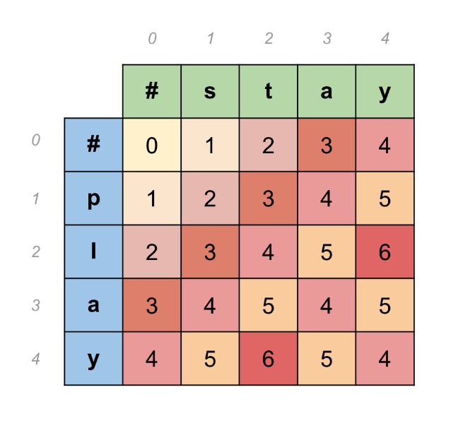
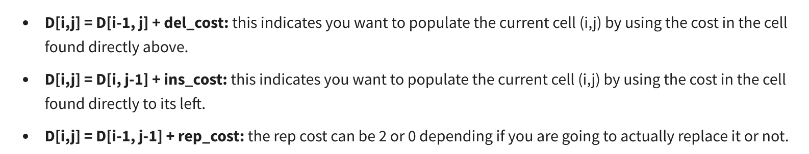

# Introduction
* Autocorrect is the process where misspelled or out of context words are corrected.
* Follow the steps to implement autocorrect (only misspelled part)
    * Identify a misspelled words
    * Find strings n edit distance away (these could be any random strings)
    * Filter candidates (keep only the real words from the previous steps)
    * Calculate word probabilities (choose the word that is most likely to occur in that context)

# Building the model
* To identify the misspelled words, you can check whether it is in the vocabulary or not.
* Find strings n edit distance away
    * Use dynamic programming
    * Edit is an operation performed on a string to change it
    * Includes insert (cost = 1), delete (cost = 1), swap adjacent letters (cost = 2), replace (cost = 2).
* To filter candidates, use the vocabulary.
* Now calculate probabilities of individual words which is number of times the word appears / total size of the corpus

# Minimum eit distance
* It allows you to evaluate similarity between two strings, find minimum numbe rof edits between two strongs, implement spelling correction, document similarity, machine translation, DNA sequencing etc.
* Here, only 3 edits are considered viz insert, delete and replace.
* Algorithm
    * Start with a source word and transform it into the target word.
    * Use tabular form to keep track of the edit distances as shown below.
        * 
    * Equations
        * 
    * Finally, take the minimum of the outputs of all the three equations.
    * Finally, the value at d[m,n] is the minimum edit distance for that particular pair of strings.
* This is also called as levenshtein distance which specified the cost per operation.