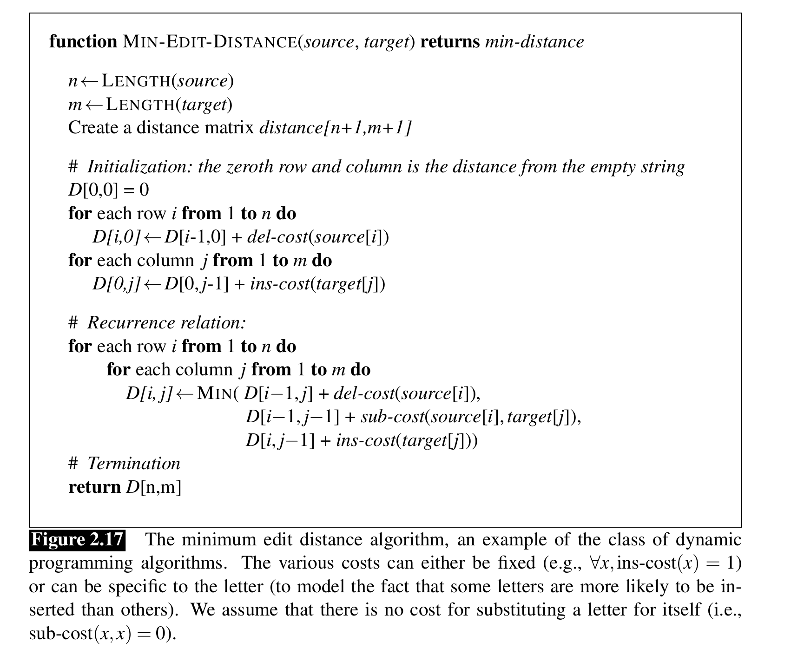

# Introduction
* Helps in quantifying how similar two strings are.
* Minimum edit distance betwen two strongs is defined as the minimum number of editing operations (like insertion, deletion or substitution) are needed to transform one string into another.
* **Alignment** - Given two sequences, an alignment is a correspondence between substrings and of the two sequences.
* Sometimes, we also assign a particular cost or weight to each of these operations.
* The levenshtein distance between two sequences is the simplest weighting factor where each operation has the cost 1.
* Another is insertion and deletion costs 1 and substitution costs 2 as it can be considered as combination of deletion and insertion.
* **Algorithm (minimum edit distance)**
    * It is a DP algorithm which uses table based approach.
    * Look video or read book for better understanding.
    * 
* This edit distance can also be used to compute the word error rate and can be extended to yield minimum alignment cost.
* Basically, it comprises of two steps. First in which we add backpointers to the main string and second in which we backtrace the required backpointers.
* **Viterbi algorithm is a probabilistic extension of minimum edit distance.**