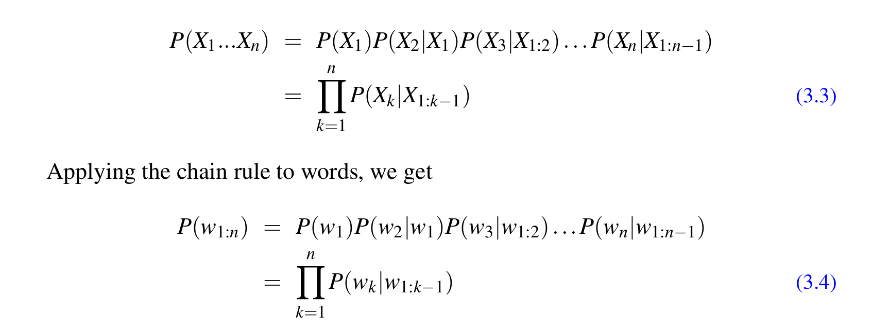
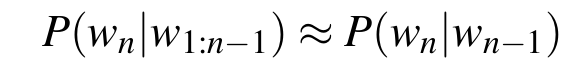
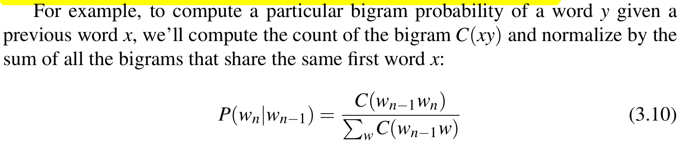
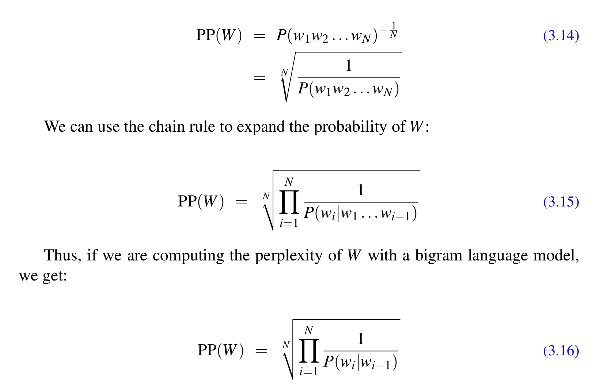
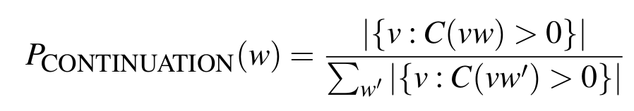
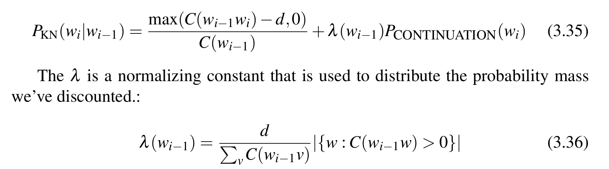

# Introduction
* Predicting few future words are easier as compared to whole sentences.
* Hence, a model that assigns a probability to each possible next word can be very useful in speech recognition.
* Probabilities are also important for augmentative and alternative communication systems.
* Models that assign probabilities to sequence of words are called language models or LMs.
* N-Gram is the simplest model that assigns probabilities to secntences and sequene of words.

# N-Grams
* We denote P(w | h) as "pw|h" which means probability that the next word is w given the history h.
* One way to estimate this probability is from relative frequency i.e find total counts of h and total counts of h followed by w.
* Works fine in many cases but similar sentence might be ignored resulting into count being 0.
* Furthermore, counting can be huge if individual words are taken into account.
* Simplification and cleverer method is using chain rule of probability.
* The chain rule shows the link between cimputing the joint probability of a sequence and computing the conditional probability of a word given previous words.
* 
* However, the problem with this approach is that we do not know exact probability of a word given a long sequence of preceding words.
* **The intuition of n-gram model is that instead of computing the probabiliy of a word given its entire history, we can appoximate the history by just the last few words.**
* For example, for bigram model, the approximation looks something as follows
    * 
* This assumption is also called a markov assumption.
* To estimate n-gram probabilities, we use MLE.
* We get MLE estimate for the parameters of an n-gram model by getting counts from a corpus, and normalizing the counts so that they lie between 0 and 1.
* 
* For true probability distribution, usually start and end symbol are added.
* Start symbol is added for n-1 times and end symbol added only once. (\<s> and \</s>)
* Thus, n-gram probabilities are calculated by dividing the obsereved frequency of a particular sequence by the observed frequency of a prefix. (Also called relative frequency)
* These probabilities (esp for bigrams) aencode some syntactice facts.

# Evaluation
* Extrinsic evaluation - Embed a model in an application and measure how much the application improves.
* Intrinsic evaluation - Metric that measures the quality of a model independent of any application.
* The model which assigns a higher probability to the test set (meaning it more accuractely predicts the test set) is a better model.
* A development set or devset is a test set which is used for training.
* **Perplexity**
    * A probability based metric
    * Defined on test set
    * It is the inverse probability of the test set, normalized by the number of words.
    * 
    * Since we want to maximize the probability, we tend to minimize the perplexity.
    * Can also be thought of as the weighted average branching factor of a language.
    * Branching factor of a language is the number of possible next words that can follow any word.
    * In computing perplexities, the n-gram model P must be constructed without any knowledge of the test set or any prior knowledge of the vocab of the test set otherwise perplexity will be artificially low.

# Issues
* More you multiply probabilities, the smaller it gets and hence to solve that, we use log probabilities.
* The above phenomena where raw probability multiplications results in so small numbers might result into numerical underflow where a program can't store infinitestimally small values.
* It is never possible to exactly match the distribution of train and test dataset.
* As a result, there is a possibility that a particular sequence of words never occur in training dataset but is seen in test dataset.
* Due to this, the probability assigned by the n-gram model for that sentence is 0 and by extension, the probability for entire test set becomes 0.

# Zeros Problem solution
* First Method
    * We can fixate the problem to a pre-defined closed vocab system.
    * Then convert any word in the training set that is not in this set to the unknown word token in a text normalization step (\<UNK>).
    * Estimate the probabilities for \<UNK> from its counts just like any other regular word in the training set.
* Second Method
    * Suppose we dont have  a prior vocab in advance.
    * We create such a vocab implicitly by replacing words in training data by \<UNK> based on their frequency.
    * Then we train the language model as before.

# Smoothing
* Suppose a word is in training set but appear in a test set in an unseen context.
* To keep a language model from assigning zero probability to these unseen events, we will have to shave off a bit of probability mass from some more frequent events and give it to the events we have never seen.
* This is called smoothing or discounting.
* Laplace Smoothing
    * Simply add 1 to all the n-gram counts before normalizing them into probabilities.
    * Not much usefull in modern n-grams but practical for other tasks like text classification.
    * Look for base and adjusted count formula.
    * **Discount** is similar but here simply take the ratio of adjusted count to original counts.
    * This is sometimes also called add-one smoothing
* Add-k smoothing
    * Instead of adding 1, we add k (generally less than 1).
* Backoff and Interpolation
    * The idea behind both is that instead of using a trigram context (for a text for which we have no examples), we can use a bigram.
    * Hence, using less context in order to generalize more for xontexts that the model hasn't learned much about.
    * In backoff, we use a lower-order n-gram if we have zero evidence for a higher-order n-gram.
    * By contract, in interpolation, we always mix the probability estimates from all the n-gram estimatros weighting and combining them.
    * Linear Interpolation implies simply weighted average of probabilities.
    * Conditional interpolation means that we choose the value of lambda based on the relative importance of n-grams.
    * Use held-out corpus which is an additional training corpus for hyperparameters.
    * Backoff + discounting is called **katz backoff** (Look for more detail and for good-turing backoff).
* Kneser-Ney Smoothing
    * Based on absolute discounting method.
    * Intuition is to subtract a fixed discount d from each count.
    * Basically, since we have a good estimates of very high counts, a small discount d won't affect them much but majorly modify smaller counts.
    * Kneser-ney smoothing is slightly different than absolute discounting.
    * It answers the question "How likely is w to appear as a novel continuation?"
    * Idea is to see the number of different contexts word w has appeared in or the number of bigram types it completes.
    * 
    * Interpolated KN Smoothing
        * 
    * Read and understand more about it if needed

# Extras
* Perplexities should be compared across language models with the same vocab because a different language model can achieve low perplexity by choosing a small vocab and assigning the unknown word a high probability.