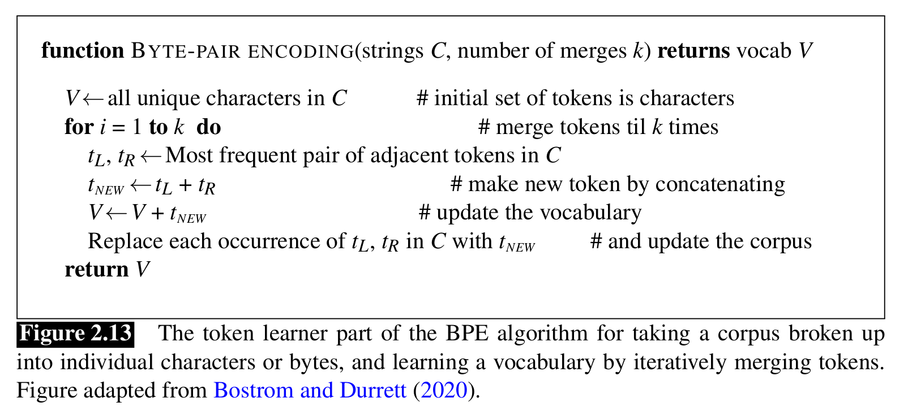

# Introduction
* It is a process of transforming text in order to reduce its randomness and bringing it closer to a predefined standard.
* Helps in reducing the amount of different information that the computer has to deal with.
* There are at least three tasks that are applied
    * Tokenizing (segmenting) words.
    * Normalizing word formats.
    * Segmenting sentences.

# Tokenization
* Unix tools like tr can be used to tokenize words.
* However, we need a strong and powerful regex to take into account various punctuations, special characters etc.
* Hence, a tokenizer can be used to expan clitic contractions which is a part of word that can't stand on its own and can only occur when attached with another word (like doesn't).
* **Penn Treebank**
    * Commonly used tokenization standard.
    * Spearates outs clitics but keeps hyphenated words together and separates out all punctuations.
    * It is a **deterministic method** based on regex.
* Most tokenization schemes have two parts
    * Token learner - takes a raw training corpus and induces a vocab, a set of tokens.
    * Token segmenter - takes a raw **test** sentence and segments it into the tokens in the vocab.
    * Three used algos are byte-pair encoding, unigram language modeling and wordpiece.
* **Byte-Pair Encoding**
    * There is a problem of unknown words. For eg. our corpus might contain the word low, lowest, new, newer but not the word lower.
    * This algorithm deals with such issues.
    * It automatically induce sets of tokens that include tokens smaller than words called subwords.
    * Furthermore, it denotes the end of sentence via a special character "_".
    * 

# Word normalization
* It is the task of putting words/tokens in a standard formate, choosing a single normal form for words with multiple forms like USA or US.
* Spelling info is lost.
* **Case folding**
    * Another form of normalization.
    * mapping everything to either lower or upper case.
    * helpful in speech recognition or information retrieval.
* **Lemmatization**
    * Task of determining that two words have the same root, despite their surface differences.
    * the most sophisticated way is complete morphological parsing of the word.
    * Morphology is the study of the way words are built up from smaller meaning-bearing units called morphemes.
    * A word contains two morphenes called stems (central morpheme of the word) and affixes (adding additional meaning of various kinds)
* Stemming
    * Process of morphological analysis which mainly consists of chopping off word-final affixes.
    * **Porter Algo** is the most commonly used stemming algorithm.

# Sentence Segmentation
* The most useful cues are punctuations.
* There is always an ambiguity associated with periods becuase it may indicate end of sentence or an abbreviation or sometimes both.
* Hence, sentence and word tokenization is done jointly.
* Usually done by first decideing the rules and whether a period is aprt of word or is a sentece boundary.
* To accomplish this, there are many dictionaries (either manually created or machine learned).